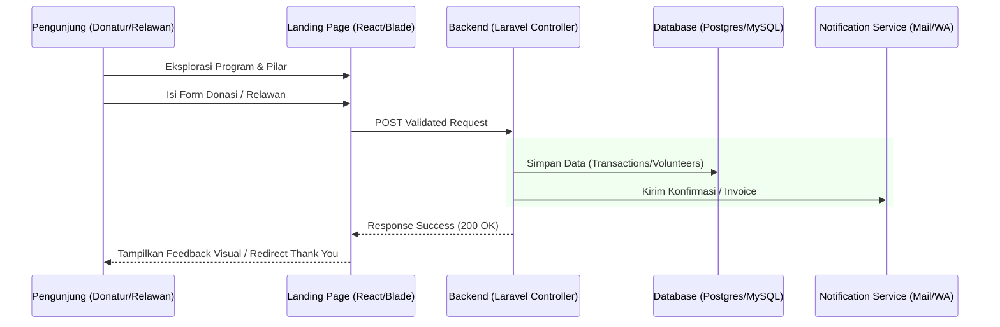
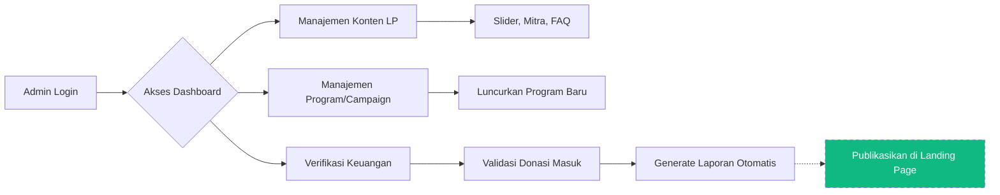

# 🌿 FundUnity: Elevasi Dampak Sosial (Laravel x React Edition)

**FundUnity** adalah platform manajemen dampak sosial terintegrasi yang kini sedang dalam tahap **re-engineering** ke ekosistem **Laravel 11**. Proyek ini menggabungkan presisi **UI/UX Modern (React)** dengan kekuatan **Enterprise Backend (Laravel)** untuk menciptakan solusi crowdfunding dan transparansi sosial yang kokoh.

---

## 🌟 Visi & Filosofi Lead UI/UX

Sebagai sebuah proyek yang dipimpin oleh **UI/UX Designer**, kami tidak hanya membangun fitur, tapi membangun **kepercayaan**. Dengan migrasi ke Laravel, kami memperkuat *backbone* sistem agar visual yang indah memiliki performa dan keamanan tingkat tinggi.

> "Visual yang memukau tanpa sistem yang kokoh adalah janji kosong. FundUnity hadir untuk memberikan keduanya."

---

## 🏗️ Arsitektur & Alur Sistem (System Flow)

### 1. Diagram Alir: Pengalaman Pengguna (Landing Page)
Alur ini menjelaskan bagaimana *stakeholder* eksternal berinteraksi dengan portal publik untuk memberikan dampak.

### 2. Diagram Alir: Manajemen Internal (Admin Dashboard)
Alur ini menunjukkan bagaimana administrator mengelola operasional organisasi secara profesional.

---

## 🎨 Sistem Desain (The Visual Infrastructure)

Meskipun sistem dirembak ke Laravel, **Design Tokens** tetap menjadi panduan utama bagi tim Frontend dan Backend.

### Palet Dasar & Tipografi
- **Primary Emerald (`#10b981`)**: Digunakan untuk elemen KPI, Button Utama, dan Status Sukses.
- **Urgent Orange (`#f97316`)**: Digunakan untuk indikator target kampanye yang belum tercapai.
- **Inter Font Family**: Digunakan secara global untuk memastikan keterbacaan data numerik pada laporan keuangan.

### Aturan Frontend (Vite/React)
- **Rounded Corners**: Konsistensi `rounded-2xl` untuk card dashboard.
- **State Management**: Sinkronisasi antara Laravel API dengan React Hooks untuk pengalaman tanpa jeda.

---

## ⚙️ Backend Spec & Database (Laravel Powered)

Bagian ini penting bagi tim Backend untuk memahami struktur logika yang diinginkan oleh Desainer/Lead.

### Modul Backend Utama:
1. **Landing Management**: Controller yang menangani data dinamis untuk Banner, Testimony, dan FAQ.
2. **Campaign Engine**: Logika perhitungan progres dana (`dana_terkumpul` / `target_dana` * 100).
3. **Volunteer Pipeline**: Sistem antrean dan verifikasi relawan baru.
4. **Transparency Module**: Agregasi data transaksi untuk ditampilkan dalam bentuk grafik interaktif.

### Schema Inti (Pratinjau):
- `campaigns`: (id, title, slug, description, target_amount, current_amount, status, due_date).
- `volunteers`: (id, name, email, skills, motivation, status_verifikasi).
- `transactions`: (id, campaign_id, donor_name, amount, payment_method, proof_image, is_verified).
- `settings`: (id, org_name, logo, contact_info, seo_meta).

---

## 📂 Struktur Folder Proyek (Hybrid Environment)

- `fundunity/`: **Legacy/Main Laravel Backend** (Aset, Logic, DB).
- `uifix/`: **Optimized Frontend (React/Vite)** yang berfungsi sebagai antarmuka user-centric berkualitas tinggi.
- `src/components/Landing`: Komponen UI premium untuk gerbang depan.
- `src/components/` (Root): Modul Admin Dashboard yang modular.

---

## 🚀 Panduan Pengembangan Bersama

### Untuk Tim Backend:
- Pastikan API Endpoint ramah terhadap kebutuhan data visual (JSON terstruktur).
- Gunakan Laravel Sanctum untuk autentikasi yang aman antara FE dan BE.
- Implementasikan **Caching** pada data landing page yang jarang berubah untuk performa maksimal.

### Untuk Tim Frontend:
- Tetap gunakan `noHeader` prop untuk fleksibilitas komponen.
- Pastikan animasi Framer Motion tidak membebani performa browser (tetap ringan).

---

### 👨‍💻 Developed with 💚 by the Design-to-Code Initiative
*Misi kami adalah menciptakan harmoni antara UX yang "memanjakan mata" dan Backend yang "tahan banting".*
